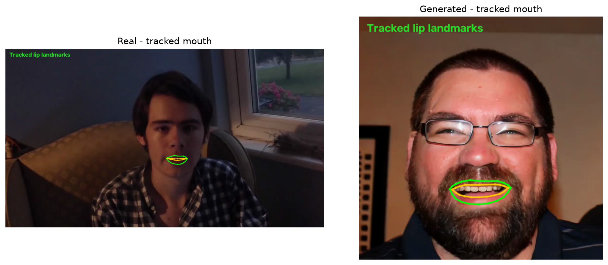
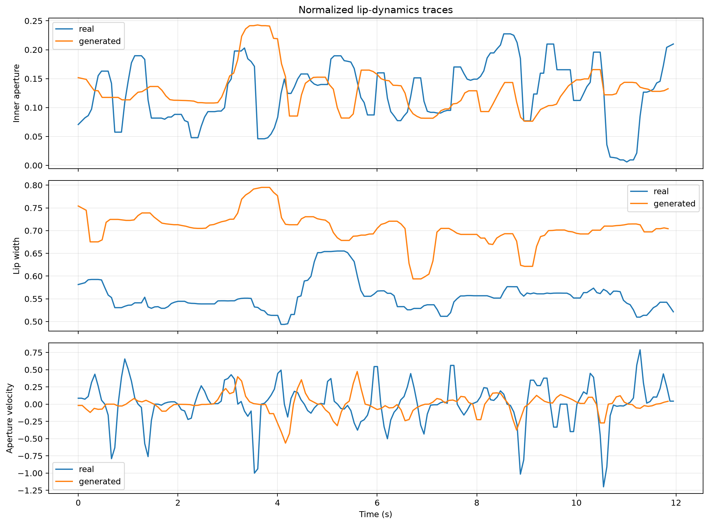

# FIT5230 Light - Context Matters

Initial course-project repository for **FIT5230 Malicious AI, Theme 3: Speech-to-Face (S2F), Light/Defense**.

## Project idea

AI-generated talking faces can achieve plausible global lip synchronization while still producing mouth transitions that are weakly conditioned on neighboring phonetic context. We investigate whether these context-dependent lip dynamics can provide interpretable evidence for S2F deepfake detection.

**Working title:** *Context Matters: Context-Conditioned Lip Dynamics for Speech-to-Face Deepfake Detection*

## Reference baseline

Our main technical baseline is:

- **PIA: Deepfake Detection Using Phoneme-Temporal and Identity-Dynamic Analysis**
- [Paper](https://openaccess.thecvf.com/content/ICCV2025W/APAI/papers/Datta_PIA_Deepfake_Detection_Using_Phoneme-Temporal_and_Identity-Dynamic_Analysis_ICCVW_2025_paper.pdf)
- [Official repository](https://github.com/skrantidatta/PIA)

PIA motivates the use of phoneme-temporal, lip-geometry, visual, and identity-dynamic evidence. This Milestone 1 repository does **not** claim a full PIA reproduction. It provides our own initial, executable extension around the phoneme-and-lip-dynamics premise.

Additional references:

- [CALS: Exploring Phonetic Context-Aware Lip-Sync for Talking Face Generation](https://arxiv.org/abs/2305.19556) - theoretical motivation for phonetic context and coarticulation.
- [GenVidBench](https://github.com/genvidbench/GenVidBench) - general AI-generated-video evaluation reference.

## Initial customization beyond the reference baseline

The Milestone 1 notebook adds a lightweight and interpretable S2F preprocessing path:

1. accepts real and generated MP4 talking-face clips;
2. tracks mouth landmarks with MediaPipe;
3. normalizes lip aperture and width using face scale;
4. derives velocity, acceleration, and jerk from lip trajectories;
5. supports manually specified word or phoneme intervals for controlled pilots;
6. visualizes real-versus-generated motion traces; and
7. exports per-frame CSV features, summary JSON, and environment metadata.

These additions demonstrate initial customization and setup. Automatic phoneme alignment, PIA inference, controlled context-matched negatives, and the context-conditioned classifier remain planned work for later milestones.

## Reproducible Milestone 1 smoke test

The notebook can automatically download:

- one licensed Wikitongues real talking-face clip; and
- one public Hallo-generated example from TalkingHeadBench.

The public pair has already completed the pipeline with 100% sampled-frame landmark coverage. Because the clips contain different identities and speech, their feature differences are **software-execution evidence only**, not proof of detector accuracy.





## Run in Google Colab

1. Open [`milestone1/milestone1.ipynb`](milestone1/milestone1.ipynb) in Google Colab.
2. Select **Runtime > Run all**.
3. Keep `USE_PUBLIC_DEMO = True` for the reproducible smoke test, or set it to `False` and upload your own short MP4 clips.
4. Confirm that the quality-control table, landmark previews, trajectory plots, CSV files, and JSON files are produced.

For local execution, install the packages in [`requirements.txt`](requirements.txt). The notebook remains the recommended execution path.

## Repository structure

```text
.
├── README.md
├── requirements.txt
└── milestone1/
    ├── milestone1.ipynb
    ├── README.md
    ├── Interactive_Challenge.md
    ├── Public_Demo_Sources.md
    ├── verify_milestone1.py
    └── demo_outputs/
```

## Interactive challenge

The proposed **Context-Swap Gauntlet** asks other teams to classify metadata-stripped real and generated clips and, for predicted fakes, identify the most suspicious time interval and primary cue. The full proposed rules are in [`milestone1/Interactive_Challenge.md`](milestone1/Interactive_Challenge.md).

## Scope and responsible use

This repository is for defensive media-forensics research and coursework. Recordings must be consented or appropriately licensed. Hidden evaluation labels, personal videos, credentials, and private working materials are intentionally excluded.
